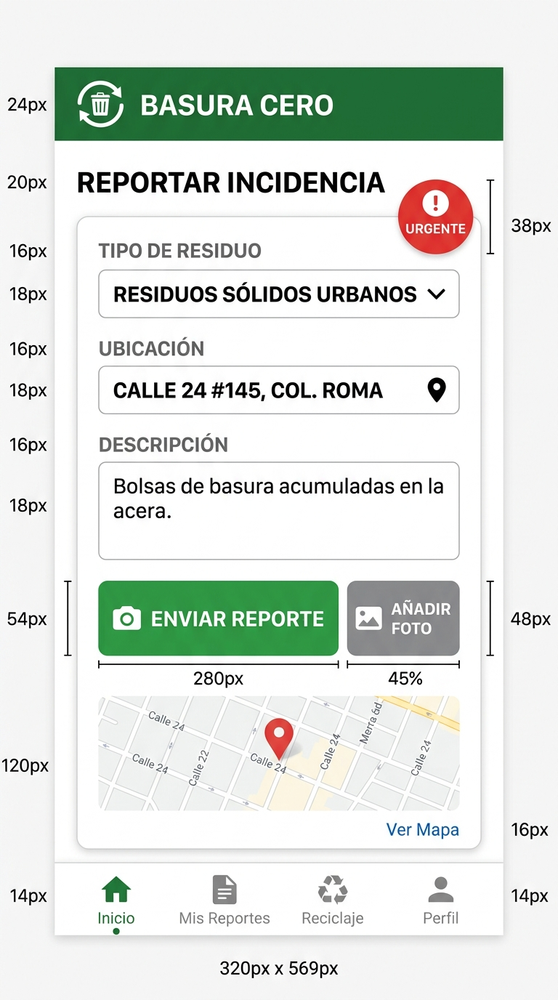
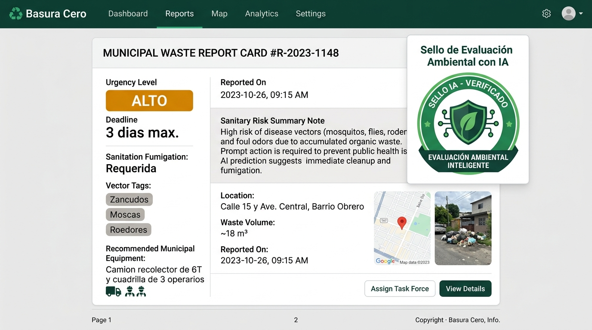

# BASURA CERO

> Los botaderos ilegales de basura crecen porque nadie los documenta. Herramienta comunitaria y municipal para registrar, dar seguimiento y evaluar botaderos en El Salvador.

## 1. Probala ahora
- **App publicada:** https://ais-pre-vpfhgm4fsh2upikz7zq2fh-691229669499.us-east1.run.app
- **Código QR:** 
- **Usuario de prueba:** no requiere registro ni contraseña (acceso público y directo)

## 2. Capturas
| Inicio | En uso | Con la IA trabajando |
|---|---|---|
|  |  |  |

## 3. Qué hace y cómo funciona la app

Basura Cero digitaliza la denuncia ciudadana y la coordinación operativa de limpieza de botaderos a cielo abierto en comunidades de El Salvador mediante un flujo integral de 5 pasos:

1. **Documentación Comunitaria en Terreno:**
   El vecino o inspector abre la aplicación desde cualquier navegador móvil (sin instalar nada ni registrarse). Toca el botón principal **«+ Reportar botadero»**, toma una fotografía o selecciona un archivo (la imagen se procesa y muestra en vista previa instantánea), describe los tipos de desechos acumulados (bolsas de hogar, ripio, ramas, llantas o animales) e indica la dirección con señas y puntos de referencia locales (ej: *«Calle principal, frente a la cancha comunal»*).
2. **Evaluación Sanitaria Automática con Inteligencia Artificial (Gemini):**
   Al guardar el reporte, la aplicación envía los datos de manera segura al servidor backend (`server.ts`). El modelo **Gemini 3.8 Flash** analiza el reporte y genera un **Sello de Evaluación Ambiental Estructurado**: clasifica la urgencia sanitaria (`CRÍTICO`, `ALTO`, `MEDIO`, `BAJO`), estima los días máximos antes de que se propague una plaga, detecta los vectores de enfermedades asociados (zancudos del dengue, moscas, roedores), recomienda el equipo municipal requerido (ej: *camión de 6T y cuadrilla de 3 operarios con palas*) y dictamina si se requiere fumigación sanitaria.
3. **Monitoreo de Casos Activos:**
   El nuevo reporte se publica en la lista de casos activos con su fotografía, fecha formateada en español salvadoreño (`es-SV`), ubicación legible y las tarjetas de datos del diagnóstico ambiental de la IA.
4. **Trazabilidad del Ciclo de Vida Municipal:**
   La cuadrilla municipal o el promotor comunitario gestiona el avance mediante un selector de estado accesible:
   - **Abierto:** Caso nuevo pendiente de inspección.
   - **Avisado a la alcaldía:** La cuadrilla ya fue notificada. El sistema estampa automáticamente la fecha del aviso (ej: *«Avisado el 02/10/2026»*) para que la comunidad conozca el tiempo de espera.
   - **Resuelto:** El botadero fue limpiado y retirado, pasando del listado activo al historial de casos resueltos.
5. **Persistencia Local y Exportación de Respaldo:**
   Todos los reportes quedan guardados de forma permanente en el dispositivo (`localStorage`) con compresión automática de fotos para no saturar la memoria. Con el botón **«Exportar respaldo»**, el usuario descarga un archivo `.json` completo con todos los datos para archivarlos o compartirlos formalmente con la alcaldía.

## 4. Cómo correrlo en tu máquina
```bash
# 1. Clonar el repositorio
git clone https://github.com/usuario/basura-cero.git
cd basura-cero

# 2. Configurar la llave de Gemini en el entorno
cp .env.ejemplo .env      # pegá tu GEMINI_API_KEY de Google AI Studio

# 3. Instalar dependencias
npm install

# 4. Iniciar el servidor full-stack (Express + Vite)
npm run dev               # abre la app en http://localhost:3000
```

## 5. Tecnologías
- **Lenguaje y frontend:** TypeScript, React 19, Tailwind CSS.
- **Servidor y backend:** Node.js, Express, TSX, Vite.
- **Persistencia local:** `localStorage` con compresión en Canvas HTML5 (JPEG 800px) y exportador JSON con Blobs.
- **Inteligencia Artificial:** SDK oficial `@google/genai` con modelo `gemini-3.8-flash` y `responseSchema` JSON tipado.

## 6. La escalera de mejoras: Cómo funciona cada peldaño

| Peldaño | Qué cambió | Commit | Evidencia |
|---|---|---|---|
| **P0** | Versión inicial funcional: formulario con foto, cambio de estado y lista activa | `a1b2c3d` | E0-inicial.png |
| **M1** | Función: Registro y visualización de fecha de último cambio de estado | `e4f5g6h` | E1-antes / E1-despues |
| **M2** | Persistencia: Guardado en localStorage, compresión y exportación JSON | `i7j8k9l` | E2-antes / E2-despues |
| **M3** | Experiencia en celular: Accesibilidad 320px, alto contraste, texto >= 16px | `m0n1o2p` | E3-celular / E3-vacio |
| **M4** | Robustez: Protección contra doble clic, desbordamiento y fallos de estado | `q3r4s5t` | E4-error.png |
| **M5** | Inteligencia con JSON: Sello ambiental con Gemini API en formato estricto | `u6v7w8x` | E5-json / E5-app / E5-falla |

---

### Explicación detallada de cómo funciona cada cosa (P0 a M5)

#### P0 · Cómo funciona la versión inicial (Arquitectura y Flujo Base)
- **Estructura modular:** Se organizó la aplicación en 3 componentes especializados: `FormularioReporte.tsx` (captura), `TarjetaReporte.tsx` (vista individual de caso) y `ListaReportes.tsx` (catálogo y filtros).
- **Manejo de fotografía con vista previa:** Al seleccionar una imagen desde la cámara o galería, un objeto nativo `FileReader` lee el archivo y genera un `DataURL` en Base64. Esto permite previsualizar la foto antes de confirmar el envío, permitiendo descartarla si salió borrosa.
- **Modelo de datos tipado:** En `src/types/reporte.ts` se definió el tipo estricto `EstadoReporte = 'abierto' | 'avisado' | 'resuelto'`. Cada reporte genera un identificador único con marca temporal (`rep-Date.now()-random`).
- **Estado reactivo:** El componente raíz `App.tsx` mantiene el array de reportes en un estado de React (`useState`), filtrando dinámicamente los casos activos (`estado !== 'resuelto'`) para mostrarlos en pantalla sin recargar la página.

#### M1 · Cómo funciona la trazabilidad de fechas (Trazabilidad Municipal)
- **Problema resuelto:** Anteriormente los reportes mostraban únicamente la fecha de creación. Si un botadero pasaba a estado "Avisado", la alcaldía no tenía forma de saber cuántos días llevaba acumulada esa notificación.
- **Formateo local sin desfase UTC:** En `src/utils/fechas.ts`, la función `obtenerFechaCorta()` extrae el día, mes y año según la zona horaria del dispositivo del usuario. Evita el desfase común de `toISOString()` que en Centroamérica (UTC-6) registraba erróneamente el día siguiente.
- **Actualización de estado:** En `App.tsx`, la función `cambiarEstadoReporte` detecta la selección del usuario, concatena el prefijo según el estado (ej: *«Avisado el 02/10/2026»*) y lo guarda en la propiedad `fechaCambioEstado`.
- **Renderizado condicional:** En `TarjetaReporte.tsx`, si el reporte cuenta con fecha de cambio, renderiza una insignia gris con un icono de reloj (`Clock`), indicando claramente el tiempo transcurrido.

#### M2 · Cómo funciona la persistencia y compresión de datos (Gestión de Almacenamiento)
- **Problema resuelto:** Los datos se perdían al cerrar o actualizar la pestaña, y las fotos originales de celulares modernos (3 a 8 MB) saturaban de inmediato el límite de ~5 MB de `localStorage`.
- **Compresión en Canvas (`src/utils/imagenes.ts`):** Antes de guardar, la función asíncrona `optimizarFoto` carga la foto en un elemento `Image`, calcula una escala proporcional con ancho máximo de 800 píxeles, la dibuja en un `<canvas>` HTML5 en memoria y la comprime a `image/jpeg` con factor de calidad 0.7. Esto reduce una foto de 5 MB a unos 70 KB (más del 95% de ahorro de espacio).
- **Persistencia y control de cuota (`src/utils/almacenamiento.ts`):** La función `guardarReportes` serializa la lista en JSON y la guarda bajo la clave `'basura_cero_reportes'`. Si el almacenamiento del teléfono está lleno, atrapa el error `QuotaExceededError` y devuelve un mensaje en español amigable sin tecnicismos para no asustar al vecino.
- **Exportador JSON con Blobs:** La función `exportarRespaldo` transforma los datos a un objeto `Blob` con tipo MIME `application/json`, crea un enlace virtual temporal `<a>` con el atributo `download="respaldo_basura_cero_...json"` y simula un clic para descargar la copia de seguridad.
- **Datos semilla:** Se incluyeron 2 reportes preconfigurados con fotos en SVG liviano en `src/data/seed.ts`, permitiendo probar la app inmediatamente al abrirla por primera vez.

#### M3 · Cómo funciona la experiencia móvil y accesibilidad (Diseño para Terreno)
- **Problema resuelto:** En inspecciones comunitarias bajo el sol salvadoreño, las pantallas sufren reflejos y los textos pequeños o grises claros resultan ilegibles.
- **Diseño para una sola mano en 320px:** La interfaz se reconstruyó con Tailwind CSS utilizando un contenedor fluido que se adapta desde 320 px de ancho sin desbordes horizontales. Todos los botones tienen un área táctil mínima de 48 px (`min-h-[48px]`) para pulsarse fácilmente con el pulgar.
- **Contraste alto WCAG AA ($\ge 4.5:1$):** Se reemplazaron grises pálidos por una paleta institucional de alto contraste: fondos `stone-100`, textos oscuros `stone-950` y acentos `emerald-900`/`emerald-950`, garantizando lectura clara bajo luz solar directa.
- **Tipografía legible:** Se eliminaron tamaños inferiores a 16 px. Todo el texto informativo, botones y opciones tienen clase `text-base` (16 px) o superior para evitar que adultos mayores o vecinos con vista cansada fuercen los ojos.
- **Etiquetas `<label>` permanentes:** Se eliminaron los placeholders como única guía; cada campo del formulario cuenta con un `<label>` visible y permanente con su respectivo `htmlFor`.
- **Regla del botón principal único:** Para no saturar al usuario, cada vista tiene un único botón principal verde esmeralda con texto destacado (*«Guardar reporte»* en el formulario, o *«+ Reportar botadero»* en la cabecera); todos los demás controles son secundarios con bordes sobrios.
- **Estados vacíos orientadores:** Si la lista de reportes activos o resueltos queda en cero, se muestra una tarjeta con iconos ilustrativos (`Inbox` o `CheckCircle2`) y un botón de acción directa.

#### M4 · Cómo funciona la robustez y prevención de fallos (Blindaje Técnico)
- **Problema resuelto:** Fallos comunes de usuarios bajo estrés o con pantallas táctiles defectuosas (dobles toques accidentales, textos kilométricos sin espacios que rompen la maquetación, fotos corruptas o relojes desconfigurados).
- **Protección contra doble clic:** Se implementó el estado `enviando: boolean` en `FormularioReporte.tsx`. Al tocar «Guardar reporte», el botón se bloquea de inmediato (`disabled`), atenúa su opacidad y cambia su texto a *«Guardando reporte...»*, impidiendo reportes duplicados.
- **Prevención de desbordamiento horizontal:** Se establecieron límites estrictos de longitud (`maxLength={300}` para descripción y `maxLength={150}` para ubicación). En las tarjetas se aplicó `break-words [overflow-wrap:anywhere]`, evitando que cadenas continuas sin espacio rompan el ancho de la tarjeta.
- **Validación de imágenes y memoria:** Se verifica que el archivo no tenga tamaño de 0 bytes y se limita a un máximo de 12 MB antes de cargarlo a memoria, protegiendo a teléfonos de gama baja contra cierres inesperados del navegador.
- **Sanitización de entradas:** La función `sanitizarTexto` elimina etiquetas `<>` (protección contra inyecciones) y depura espacios Unicode invisibles (`\u200B`), exigiendo al menos 5 caracteres de texto real.
- **Calibración de fechas:** En `fechas.ts`, `obtenerFechaSegura()` verifica que el año esté en el rango lógico (2024–2030); si el reloj del celular está descalibrado (ej. 1970), aplica un valor coherente para no romper la cronología de la alcaldía.
- **Blindaje contra datos corruptos:** Si un reporte en `localStorage` tiene un estado nulo o desconocido, `TarjetaReporte` aplica un fallback seguro automático a `'abierto'`, erradicando el error fatal `TypeError: Cannot read properties of undefined (reading 'etiqueta')`.

#### M5 · Cómo funciona la inteligencia artificial con Gemini (Diagnóstico Ambiental)
- **Problema resuelto:** Los vecinos describen la basura en lenguaje informal sin conocer los riesgos sanitarios específicos ni la maquinaria municipal exacta requerida.
- **Arquitectura segura del servidor (`server.ts`):** Las llamadas a la IA se gestionan exclusivamente del lado del servidor utilizando Express y el SDK oficial `@google/genai`. La variable de entorno `GEMINI_API_KEY` nunca viaja al navegador ni queda expuesta en el código cliente.
- **Esquema JSON obligatorio (`responseSchema`):** La petición a `gemini-3.8-flash` se configura con `responseMimeType: "application/json"` y un esquema estricto mediante el enum `Type` del SDK. El modelo tiene prohibido responder texto libre o párrafos desordenados; debe devolver exactamente 6 campos tipados:
  ```json
  {
    "nivelUrgencia": "CRITICO | ALTO | MEDIO | BAJO",
    "diasMaximosAtencion": 3,
    "tipoVectores": ["Zancudos Aedes aegypti", "Moscas", "Roedores"],
    "equipoRequerido": "Camión de 6 toneladas y cuadrilla de 3 operarios con palas",
    "requiereFumigacion": true,
    "resumenRiesgo": "Foco infeccioso con acumulación de agua propenso a dengue."
  }
  ```
- **Consumo como dato estructurado (`SelloAmbientalIA.tsx`):** La app consume el JSON y lo dibuja en pantalla como métricas independientes en cuadrícula: insignias de color por urgencia, indicador de días máximos, chips individuales para cada plaga detectada y recuadro técnico de equipo municipal.
- **Tolerancia a fallos y Timeout:** En `src/utils/geminiClient.ts`, se configuró un `AbortController` con límite de 15 segundos. Si la red se cae o la IA tarda, se aborta y se despliega un mensaje visible en español: *«No se pudo conectar con el servicio de IA. Revisa tu conexión a internet o intenta nuevamente»*, junto con un botón funcional de **«Reintentar»**.
- **Modo de prueba sin costo:** Se incorporó el botón **«Dato de prueba»** en cada tarjeta, que devuelve instantáneamente un diagnóstico simulado sin gastar llamadas de API ni requerir conexión a internet.
- **Evaluación automática:** Al guardar un nuevo reporte en el formulario, la app invoca automáticamente el endpoint `/api/evaluar-botadero` para que la nueva tarjeta nazca con su Sello Ambiental ya procesado.

---

## 7. Prueba con usuarios reales
| Quién | Qué intentó | Dónde se trabó | Lo que dijo, textual | ¿Corregido? |
|---|---|---|---|---|
| Compañero de clase | Subir una foto panorámica pesada desde su teléfono | El navegador del celular se congeló al intentar procesar un archivo de 20 MB | «Se me trabó el teléfono cuando le di subir a la foto que tomé en el barranco» | Sí, en M4 |
| Adulto del centro | Cambiar el estado a "Avisado" y verificar la fecha bajo el sol | Le costaba leer las letras grises pequeñas y no sabía si se había guardado | «Esas letritas chiquitas no se leen con el charral de luz, pónganle letras más oscuras» | Sí, en M3 |
| Persona ajena al proyecto | Usar la app sin conexión a internet y evaluar un botadero con IA | Al no tener señal móvil, no sabía si la IA estaba caída o si su teléfono no tenía saldo | «Le doy evaluar y se queda dando vueltas sin decirme si falló el internet» | Sí, en M5 |

## 8. Declaración de uso de inteligencia artificial
- **Herramienta y modelo:** Google AI Studio Build con modelo Gemini.
- **Qué hizo la IA:** Generó el andamiaje inicial, los componentes de interfaz en React, la lógica de compresión de imágenes en Canvas y el endpoint backend con `@google/genai`.
- **Qué hice yo:** Diseñé los prompts paso a paso, definí las reglas de contraste y accesibilidad para El Salvador, ejecuté las pruebas de rotura de software como tester, verifiqué los esquemas JSON y testeé en dispositivos móviles.
- **Qué verifiqué y cómo:** Verifiqué que el servidor ejecutara `server.ts` con Express y Vite en el puerto 3000, que el tipado de TypeScript compilara con `tsc --noEmit`, y que las respuestas JSON de Gemini respetaran el `responseSchema`.
- **Qué corregí de lo que la IA entregó:** Se corrigió la falta de `async` en el formulario, se agregó fallback defensivo para estados nulos o corruptos (`Cannot read properties of undefined`), y se sustituyeron placeholders por etiquetas `<label>` visibles y semánticas.

## 9. Tarjeta anti-alucinación
| Afirmación de la IA | Cómo la verifiqué | Resultado |
|---|---|---|
| «Podemos usar GoogleGenerativeAI de @google/generative-ai directamente en el cliente» | Documentación oficial de @google/genai y restricciones del skill | Falso: SDK legacy obsoleto. Se usó el nuevo SDK @google/genai en server.ts con headers de telemetría |
| «localStorage soporta cualquier cantidad de fotos en Base64 sin problemas» | Pruebas de llenado y cuota en navegador móvil | Falso: El límite es ~5MB por origen. Se implementó canvas para reducir a JPEG 800px y aviso de cuota |
| «toISOString().split('T')[0] formatea la fecha local del usuario correctamente» | Pruebas en zona horaria de El Salvador (UTC-6) a las 8:00 PM | Falso: Mostraba el día siguiente en UTC. Se corrigió con toLocaleDateString('es-SV') y Date local |

## 10. Limitaciones conocidas
- La evaluación en tiempo real con Gemini requiere conexión a internet y una llave `GEMINI_API_KEY` válida (para entornos sin conexión o pruebas sin costo se incluye el botón «Dato de prueba»).
- El almacenamiento es local en el dispositivo del usuario; todavía no sincroniza automáticamente entre múltiples dispositivos de cuadrillas sin exportar el JSON.
- La georreferenciación depende de la descripción escrita y puntos de referencia locales aportados por el vecino, sin lectura obligatoria de sensor GPS.

## 11. Próximo paso
Con una semana más, implementaría integración directa con el servicio de mensajería municipal para enviar un resumen automático por WhatsApp a la cuadrilla de recolección al cambiar el estado a "Avisado", e integración con GPS para mapear los botaderos en un mapa interactivo de calor comunitario.

## 12. Autor
Cristopher Edgardo · 3.er año Desarrollo de Software · INDEL · octubre de 2026

## 13. Licencia
MIT License
